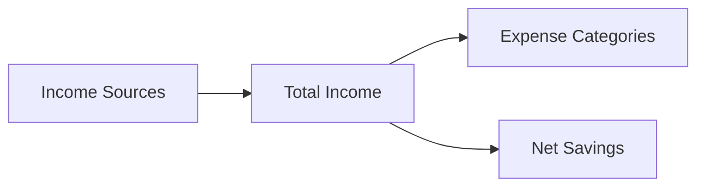

# 🏦 Vault Finance – Personal Finance & Investment Analyzer


Vault Finance is a privacy-first personal finance and investment analyzer that processes PDF bank statements and brokerage reports, tracks equity holdings, categorizes transactions, and delivers deep financial insights via interactive dashboards.

## ✨ Key Features

- **PDF & CSV Parsing**: Upload bank statements and brokerage reports (e.g., Robinhood)
- **Categorization Engine**: Multi-pass fuzzy transaction categorization
- **Smart Deduplication**: Detect and handle duplicate transactions
- **Stock & Equity Tracking**: Automatic portfolio analysis from uploaded reports
- **Money Flow Diagrams**: Visualize income and spending flows via Sankey charts
- **Interactive Dashboards**: Filterable analytics across finance and investments
- **Rules Engine**: Merchant-specific custom categorization
- **Privacy First**: All processing is done 100% locally — no data leaves your machine

## 🚀 Getting Started

### Prerequisites

- Python 3.8+
- Pip package manager

### Installation

```bash
# Clone the repository
git clone https://github.com/abtonmoy/vault_finance.git
cd vault_finance

# Install dependencies
pip install -r req.txt

# Launch the app
streamlit run app.py
```

## 🧑‍💻 Usage

1. Download **PDF or CSV** statements from your **bank** or **brokerage** (e.g., Robinhood)
2. Upload files through the interface under the respective tabs
3. Optionally adjust categorization and deduplication settings in the sidebar
4. View your categorized transactions and investment holdings
5. Explore income flow, spending trends, and equity portfolio breakdowns
6. Export financial and investment summaries as CSV

## 📊 Features Overview

### 🔍 Categorization Engine


- Multi-pass fuzzy matching for transaction types
- Confidence scoring with review interface
- User-defined overrides and rules

### 🔄 Money Flow Visualization



- Sankey diagrams to show movement of money
- Visual summaries of inflow/outflow and savings
- Month-over-month surplus/deficit tracking

### 📈 Equity & Investment Dashboard


- Upload **Robinhood** or **brokerage** PDF/CSV reports — system parses automatically
- Track portfolio by ticker, quantity, average price, and current value
- View gain/loss, sector allocation, and performance trends
- Visualizations for diversification, holdings, and historical changes

### 📉 Deep Financial Analytics

- Time-based filtering and interactive dashboards
- Income vs. expenses by category
- Transaction type breakdowns (subscriptions, transfers, etc.)
- Exportable insights for external tools

## 🏦 Supported Sources

### Banking

- ✅ Chase Bank
- ✅ Wells Fargo
- ✅ Bank of America
- ✅ Citibank
- 🔄 Most major U.S. banks

### Brokerage

- ✅ Robinhood (PDF/CSV statements)
- ✅ Fidelity, Schwab (CSV import)
- 🔄 Other brokerages (via compatible export formats)

## 🧩 Project Structure

```
📦 Vault_finance
├─ config/
│  ├─ __init__.py
│  ├─ categories.py
│  ├─ duplicate_patterns.py
│  └─ patterns.py
│
├─ core/
│  ├─ __init__.py
│  ├─ analyzer.py
│  ├─ categorizer.py
│  └─ parser.py
│
├─ data/
│
├─ interfaces/
│  ├─ __init__.py
│  ├─ investment_tracker.py   # Investment dashboard logic
│  ├─ main_ui.py              # Home interface
│  ├─ review_ui.py            # Categorization review
│  └─ rules_ui.py             # Custom rules
│
├─ tests/
│  ├─ __init__.py
│  └─ different_tests/
│
├─ utils/
│  ├─ __init__.py
│  ├─ equity_vis.py           # Equity-related visualizations
│  ├─ helpers.py
│  ├─ moneyflow_vis.py        # Sankey and fund flow charts
│  └─ visualization.py
│
├─ app.py
├─ .gitignore
└─ req.txt
```

## 🤝 Contributing

We welcome contributions of any kind — bug fixes, new features, documentation improvements, and more!

1. Fork the repository
2. Create a feature branch (`git checkout -b feature/YourFeature`)
3. Commit your changes
4. Push to your fork
5. Open a pull request

## 📄 License

This project is licensed under the MIT License. See the [LICENSE](LICENSE) for details.

## 📧 Contact

[Abdul Basit Tonmoy](abdulbasittonmoy11@gmail.com)  
GitHub Repo: [https://github.com/abtonmoy/vault_finance](https://github.com/abtonmoy/vault_finance)

---

**Disclaimer**: Vault Finance processes all data locally. The authors are not liable for incorrect analytics or financial loss. Always cross-check with your financial provider.
