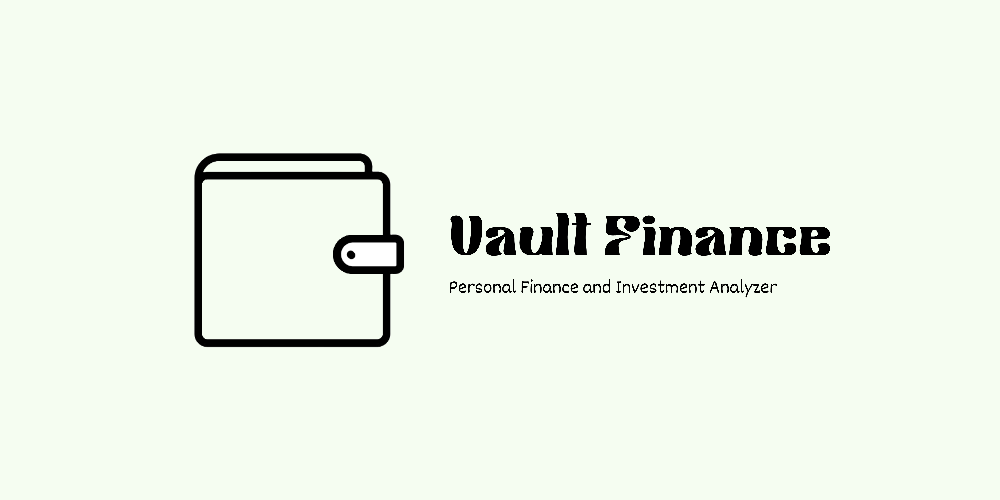

#  Vault Finance – Personal Finance & Investment Analyzer



Vault Finance is a privacy-first personal finance and investment analyzer that processes PDF bank statements and brokerage reports, tracks equity holdings, categorizes transactions, and delivers deep financial insights via interactive dashboards. It's designed to give you a clear, comprehensive view of your financial health, all while keeping your data secure and private.

## ✨ Key Features

- **Secure, Local Processing:** All data processing happens directly on your machine – no data is sent to external servers.
- **PDF & CSV Parsing:** Seamlessly upload bank statements and brokerage reports in PDF or CSV format.
- **Intelligent Categorization:** A multi-pass fuzzy matching engine automatically categorizes transactions with high accuracy. Includes a review interface for corrections.
- **Smart Deduplication:** Detects and handles duplicate transactions, preventing inflated spending reports. Handles complex scenarios like credit card payment cycles.
- **Stock & Equity Tracking:** Automatically analyzes investment portfolios from uploaded brokerage reports.
- **Money Flow Visualization:** Understand where your money is going with interactive Sankey diagrams showing income, expenses, and savings.
- **Interactive Dashboards:** Filterable analytics provide a detailed view of your finances.
- **Customizable Rules Engine:** Create merchant-specific rules to refine categorization.
- **Comprehensive Reporting:** Export financial summaries and transaction data in CSV format.

## 🚀 Getting Started

### Prerequisites

- Python 3.8 or higher
- Pip package manager

### Installation

```bash
# Clone the repository
git clone https://github.com/abtonmoy/vault_finance.git
cd vault_finance

# Install dependencies
pip install -r requirement.txt
```

````

### Running the Application

```bash
streamlit run app.py
```
````

This will launch the Vault Finance web application in your browser.

## 🧑‍💻 Usage

1. **Upload Statements:** Upload your bank and brokerage statements (PDF or CSV) through the "Upload & Analyze" tab.
2. **Review & Categorize:** The application will automatically categorize transactions. Use the "Review & Correct" tab to refine categories and create custom rules.
3. **Explore Dashboards:** Navigate to the "Investment Portfolio" tab to view your equity holdings and performance. The main dashboard provides a comprehensive overview of your finances.
4. **Customize Rules:** Create custom rules in the "Custom Rules" tab to improve categorization accuracy.
5. **Export Data:** Export your categorized transactions and financial summaries in CSV format for further analysis.

## 🏦 Supported Sources

### Banking

- ✅ Chase Bank
- 🔄 Most major U.S. banks (compatibility may vary)

### Brokerage

- ✅ Robinhood (PDF/CSV statements)
- ✅ Fidelity, Schwab (CSV import)
- 🔄 Other brokerages (via compatible export formats)

## 🧩 Project Structure

```
Vault Finance/
    ├── config/
    │   ├── categories.py
    │   ├── duplicate_patterns.py
    │   └── patterns.py
    ├── core/
    │   ├── analyzer.py
    │   ├── categorizer.py
    │   ├── parser.py
    │   └── robinhood_parser.py
    ├── interfaces/
    │   ├── investment_tracker.py
    │   ├── main_ui.py
    │   ├── review_ui.py
    │   └── rules_ui.py
    ├── tests/
    │   ├── all_tests
    │   └── ...
    ├── utils/
    │   ├── helpers.py
    │   ├── individual_vis.py
    │   ├── theme.py
    │   ├── vis.py
    │   └── visualizations.py
    ├── .gitignore
    ├── app.py
    ├── readme.md
    └── requirements.txt
```

## 🤝 Contributing

We welcome contributions of all kinds! Here's how you can get involved:

1. **Fork the repository.**
2. **Create a feature branch:** `git checkout -b feature/YourFeature`
3. **Make your changes.**
4. **Commit your changes:** `git commit -m "Add your descriptive commit message"`
5. **Push to your fork:** `git push origin feature/YourFeature`
6. **Open a pull request.**

Please ensure your code follows the project's style guidelines and includes appropriate tests.

## 📄 License

This project is licensed under the MIT License - see the [LICENSE](LICENSE) file for details.

## 📧 Contact

[Abdul Basit Tonmoy](abdulbasittonmoy11@gmail.com)
GitHub Repo: [https://github.com/abtonmoy/vault_finance](https://github.com/abtonmoy/vault_finance)

---

**Disclaimer**: Vault Finance processes all data locally. The authors are not liable for incorrect analytics or financial loss. Always cross-check with your financial provider. Use this tool at your own risk.
